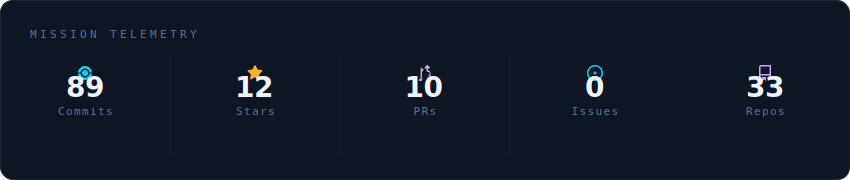

<!-- Perfil GitHub em tema galáxia — Pedro Augusto
     SVGs gerados por galaxy-profile (vinimlo/galaxy-profile)
     Atualização: GitHub Actions ou localmente com python -m generator.main -->

  

 

  

 

  

 

  

 

<strong>Mais sobre mim</strong>

 

Olá! Eu sou o **Pedro Augusto**.

- 🚀 Atualmente em busca de oportunidades
- 👁 Transformando ideias em código e código em soluções inovadoras
- 📚 **Autodidata** e sempre em busca de novos conhecimentos
- 🎓 Formado em **Engenharia de Software** pela SENAI-FATESG
- 🔭 Trabalhando em projetos pessoais
- 🌱 Aprendendo novas stacks
- 👯 Aberto a colaborar em projetos open source
- 💬 Pergunte-me sobre desenvolvimento de software, engenharia de software e tecnologia
- ⚡ Curiosidade: apaixonado por resolver problemas complexos e criar soluções inovadoras

**Projeto em destaque:** [🦆 WeaDuck — demonstração](https://weaduck.netlify.app/login)

 

  

---

*README gerado com [galaxy-profile](https://github.com/vinimlo/galaxy-profile).*
